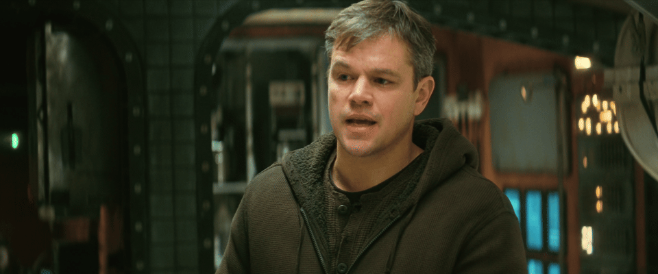
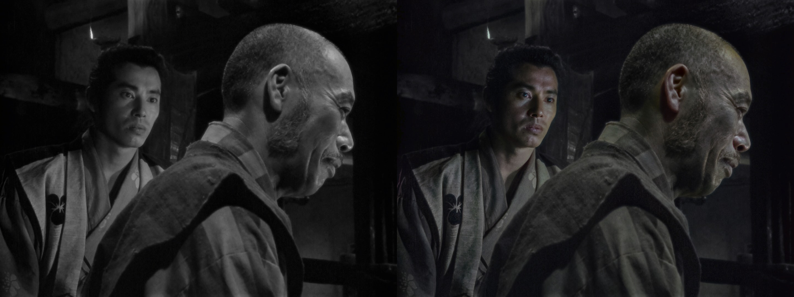
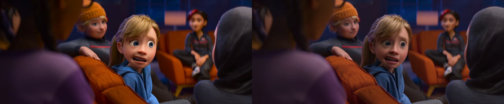
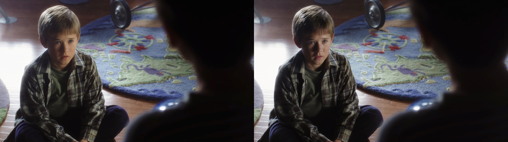

# CineLab Video Player

A video player for Windows x64 and NVIDIA RTX GPUs. It combines FFmpeg decoding, a Direct3D 12 renderer, NVIDIA Optical Flow, DLSS Super Resolution and DLSS Frame Generation, and support for DLSS Neural Rendering, for cutting-edge video playback experiments.

## If you're here just for the **Neural Rendering** :

This player doesn't come out-of-the-box with the Neural Rendering (NR) feature: you have to **manually enable it** through Reshade and its RenoDX plugin: this is to guarantee the correct licensing, but also to have a modular system, since the RenoDX plugin is in continuous evolution, you'll be able to experiment with any present or future release of the Neural Rendering feature. 

[How to enable it](docs/NEURAL_RENDERING.md)

> **Release status:** public beta. The release package targets Windows x64 systems with an NVIDIA RTX 50-series GPU. It includes the player, decoder tools, native DLSS SR, and the official production-signed NVIDIA Streamline runtime required by DLSS Frame Generation. Availability still depends on the installed NVIDIA driver and the GPU/runtime capability reported by the player.

## Features

- Opens MP4, MKV, MOV, WebM, AVI and other FFmpeg-supported formats.
- Uses a D3D12 three-frame pipeline and GPU optical flow to reconstruct video motion vectors.
- Provides SR Off, DLAA, Quality, Balanced, Performance and Ultra Performance.
- Provides DLSS Frame Generation controls when the runtime supports them.
- Includes audio, subtitles, seeking, fullscreen, image adjustments and English/Portuguese language packs.
- Offers final-image and developer views for DLSS input and motion vectors.

## Quick start

1. Download the latest `CineLabVideoPlayer-*-win64.zip` from GitHub Releases and extract it anywhere writable.
2. Run `CineLabVideoPlayer.exe`.
3. Click **Open** or drag a video into the window.
4. Leave **SR** off for native-resolution playback. Enable it only when you want DLSS reconstruction.
5. Open **Settings** for SR quality, Frame Generation, V-Sync, audio, subtitles and developer controls.
6. Use the **?** button for the in-player guide.
7. If the player works as-is, you can then experiment by adding the NR feature

## Requirements

- Windows 10 or Windows 11, 64-bit
- NVIDIA GeForce RTX 50-series GPU
- A current NVIDIA driver

The beta may start on other RTX configurations, but the supported release target is RTX 50-series hardware.

## Optional Neural Rendering / RenoDX integration

As explained in the beginning, this player is using D3D12 and it's fully compatible with Reshade and its filters and plugins: you can experiment with any sort of implementation of Reshade, and the video player is able to feed the motion vector data to it and apply the NR effect in a stable manner. See the [Neural Rendering guide](docs/NEURAL_RENDERING.md). The standard player remains fully functional without it.

## Neural Rendering gallery

The animation below alternates every two seconds between NR Off and NR On (they are not labeled on purpose):
This was made using the "default" or "A" type of NR; the "default" algorithm tends to shade objects (especially faces/people) that are too flat by applying an approximation of the scene lights, and if a light source is visible in the frame, that will become the primary source for the shading. 

  

Other algorithms ( *Natural*/B or *Cinematic*/C ) will apply genrally stronger presets of ambient lighting:
- **Natural** adds an "overcast" skylight from above, and has stronger general contrast. it will add reflections on skin, shadows under flat lighted objects, and reflections on flat shaded ground or walls
- **Cinematic** has waker skylight, but will instead add a rim/backlight to people and objects from many angles, including below faces, giving an extreme/HDR look to people, often unnatural.

In conclusion, **most of the scenes look better with the "default" algorithm**, and the other two should be probably toned down from the standard values to not look uncanny.

### Black and white movies

The NR will tend to colorize faces in B/W movies. It can look amazing in some selected scenes, but it's mostly distracting. Maybe useful for restoring old hand-colored movies:

### 3D animation

The older/flatter the rendering, the better is the effect: most modern 3D animation is so stylized or realistic that the NR often doesn't add much to the picture. As for videogames (the thing DLSS NR was trained on) **most of older '90s and '00s 3D animation or special effects in live action movies can be improved with NR:**

### Noise/haze/bloom

Scenes with hazy/bloomy lighting will be enhanced for more clarity, which can go against the original intent, or noisy footage such as heavy film grain or snow/rain/particles could be smoothed out, erasing some of the particles/noise:

  <a href="docs/NR_GALLERY.md"><strong>Browse the complete 51-scene gallery &rarr;</strong></a>

## Frame Generation

This is still an experimental feature since the quality is not satisfactory in every scene:
this video player can multiply the framerate of the video up to 6X the original, but in fast moving scenes it breaks apart, mainly because of the motion vector calculation is being confused by the motion blur of the frame, so this feature is suitable for:

- slow moving footage
- fast moving but with fast shutter/low motion blur
- high multipliers (such as 6X) for high-refresh-rate screens (such as 144hz for example)

The FG is compatible with V-sync, and when it's enabled, any multiplier that exceed the v-sync speed will be disabled.

**For 2X multiplier** the best way to obtain it is not through the DLSS Frame Generation, but with the *"Smooth Motion"* feature in the Nvidia drivers: it can be enabled in the Nvidia app/control panel by adding the .exe to the list. This option will double the FPS of any video in Cinelab Video Player, but the app needs to restart every time the setting is changed to take effect. During playback using "smooth motion" the FPS counter will still show the source FPS.

## Controls

| Action | Shortcut |
| --- | --- |
| Open video | `Ctrl+O` |
| Play / pause | `Space` |
| Back / forward 10 seconds | `Left` / `Right` |
| Mute | `M` |
| Toggle SR | `D` |
| Fullscreen | `F11` or double-click video |
| Final image | `1` |
| DLSS input | `2` |
| Motion vectors | `3` |

## Building from source

See [Building](docs/BUILDING.md). The source release contains no NVIDIA, FFmpeg, ReShade, RenoDX or other third-party runtime binaries.

## Support

If CineLab is useful to you, you can support its development:

## Project documents

- [User guide](docs/USER_GUIDE.md)
- [Neural Rendering guide](docs/NEURAL_RENDERING.md)
- [NR visual comparison guide](docs/NR_VISUAL_COMPARISONS.md)
- [Architecture](docs/ARCHITECTURE.md)
- [Building](docs/BUILDING.md)
- [Troubleshooting](docs/TROUBLESHOOTING.md)
- [Contributing](CONTRIBUTING.md)
- [Third-party notices](THIRD_PARTY.md)
- [Security policy](SECURITY.md)

## License

The project source is licensed under the [MIT License](LICENSE). NVIDIA, FFmpeg, ReShade and RenoDX are separate projects governed by their own licenses and terms. DLSS and NVIDIA are trademarks of NVIDIA Corporation. This project is not affiliated with or endorsed by NVIDIA, ReShade, RenoDX or FFmpeg.
