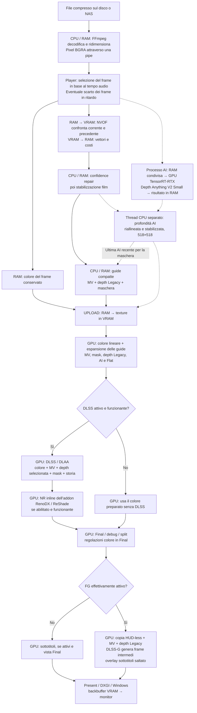
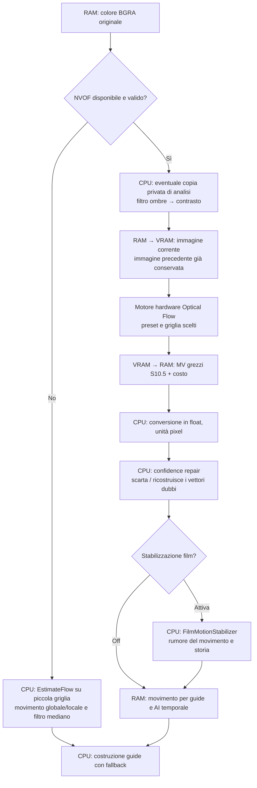
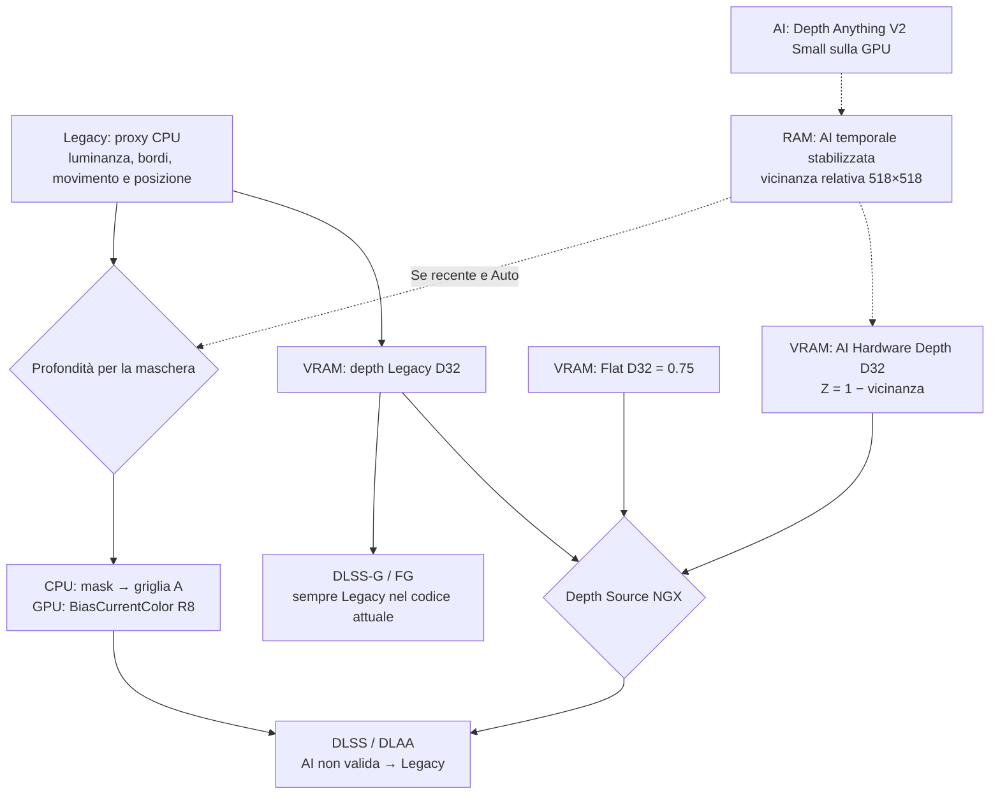

# Come viene processato un fotogramma — Step06A4D

Ricostruzione dal codice locale e dal runtime Step06A4D, 8 settembre 2026.
La guida descrive il player realmente presente in questa cartella. Le scelte
del diagramma interattivo sono illustrative: non cambiano le impostazioni del player.

## 1. Le quattro cose da distinguere

- **Immagine:** i colori che finiranno sullo schermo.
- **Vettori di movimento (MV):** indicano dove si trovava nel frame precedente
  una zona del frame corrente. Servono a riallineare la storia temporale.
- **Profondità (depth):** una stima di vicino/lontano. Il film non contiene
  lo Z-buffer geometrico di un videogioco: Legacy e AI sono entrambe stime.
- **Maschera temporale:** segnala le zone nelle quali la storia può essere
  poco affidabile. È diversa dalla profondità e dalle maschere interne dell’addon NR.

**CPU** è il processore del PC; **RAM** è la memoria di sistema. **GPU** è la
scheda grafica; **VRAM** è la sua memoria dedicata. La **RAM condivisa** del
worker AI resta RAM del PC: permette a due processi di scambiarsi dati.
Le risorse GPU e la loro residenza fisica sono comunque gestite dal driver/Windows.

## 2. Il percorso completo

Le frecce continue indicano un dato necessario al passaggio successivo;
quelle tratteggiate indicano un risultato asincrono, che può appartenere a
un’elaborazione precedente. Non sono un asse dei tempi.

Il ramo NVOF attraversa CPU e GPU, ma il player **attende** i risultati prima
di preparare le guide. L’inferenza AI e la sua stabilizzazione temporale sono
invece asincrone: il player legge l’ultimo risultato completato. Asincrono non
significa gratuito: i worker consumano CPU, GPU, RAM e banda insieme al renderer.

## 3. Decodifica e qualità: una scelta che modifica tutta la catena

Il comando FFmpeg corrente non richiede NVDEC o un altro decoder hardware:
decodifica, conversione BGRA e ridimensionamento sono nel percorso CPU. Il
fallback Media Foundation richiede output RGB32/ARGB32 in memoria CPU; può
usare accelerazioni offerte dal sistema, ma non è qui una catena di texture
GPU condivise direttamente con il renderer.

**La qualità DLSS viene usata già per scegliere le dimensioni di decodifica.**
Per questo passare da DLAA a Quality riduce anche i dati da elaborare per NVOF,
le copie e parte del lavoro delle guide; non cambia solo l’ultima inferenza.

| Impostazione | Politica di ingresso nel player |
| --- | --- |
| Auto | Sceglie un preset; non è un algoritmo DLSS distinto. A risoluzione sorgente vicina all’uscita sceglie normalmente Quality; a 4K con almeno 45 fps, Balanced. Per sorgenti più piccole sceglie il rapporto più vicino. |
| DLAA | NGX lavora alla risoluzione d’uscita. Il decode viene limitato al riquadro di uscita, senza ingrandire preventivamente la sorgente. |
| Quality | Obiettivo del decode circa 2/3 della larghezza e altezza di uscita. |
| Balanced | Circa 0,58 per dimensione. |
| Performance | Circa 1/2 per dimensione. |
| Ultra Performance | Circa 1/3 per dimensione. |

Il player evita di ingrandire nel decoder una sorgente già più piccola.
Le dimensioni vengono arrotondate e la politica NGX sceglie l’ingresso finale
ammesso dal runtime: decode e texture NGX possono avere misure diverse.

Esempio verificato: The Exorcist è 1920×1072. Con output 1918×1080 e DLAA,
il decode è 1918×1070, la griglia NVOF 2×2 è 959×535, mentre le risorse NGX
sono 1918×1080. In Quality il decode richiesto diventa 1278×720.

**DLSS OFF non annulla quel ridimensionamento.** Il player continua con il
colore che ha già decodificato e preparato. Anche il lato OFF dello split
non è automaticamente un secondo decode nativo indipendente.

## 4. Movimento: NVOF, correzione e fallback

| Variante | Dove si sceglie | Effetto |
| --- | --- | --- |
| Slow / Medium / Fast | Menu Optical Flow → Preset | Regola il livello di ricerca del motore NVOF. Non salta la correzione CPU. |
| Auto / 1×1 / 2×2 / 4×4 | Menu Optical Flow → Grid | Cambia la densità dei vettori, non la risoluzione del film mostrato. A parità di immagine, 1×1 produce quattro volte le celle di 2×2. Auto richiede normalmente 2×2 e 4×4 da 6 milioni di pixel di ingresso; il driver può adattare la richiesta supportata. |
| Fallback CPU | Automatico se NVOF non è disponibile/valido | Nel menu attuale non c’è un selettore NVOF Off. Il fallback non è un equivalente qualitativo del percorso hardware. |
| Auto Film Grain / Off, Raw | `DMP_NVOF_FILM_STABILIZE` | Off salta **solo** FilmMotionStabilizer; confidence repair resta attiva. |
| Contrasto Off / Mild / Medium / Strong | Configurazione del player / `DMP_NVOF_ANALYSIS_CONTRAST` | Trasforma esclusivamente la copia privata inviata a NVOF. Non è il contrasto del film visualizzato. |
| Filtro ombre Off / Low / Medium | Configurazione / `DMP_NVOF_SHADOW_FILTER` | Filtro 3×3 selettivo su luminanza e bordi, prima del contrasto. Solo copia privata NVOF. |

Il codice contiene gestori per contrasto e ombre, ma la costruzione del menu
corrente espone sotto NVOF soltanto Preset e Grid. Non bisogna scambiare un
gestore interno per un’opzione effettivamente presente nel menu.

La confidence repair usa texture del **colore originale** e costi NVOF:
conserva semi affidabili, cerca vicini coerenti, poi eventualmente un movimento
globale sufficientemente supportato. Dove non ha una soluzione valida usa zero.
I valori si riferiscono alla direzione **frame corrente → precedente**.

## 5. Profondità: tre sorgenti, tre destinazioni diverse

**Legacy Estimated** è un proxy euristico CPU, smussato nel tempo, non una
ricostruzione 3D della scena. **Flat 0.75** è una texture separata costante.
**AI Synthetic** usa la mappa di Depth Anything resa stabile e convertita
in una texture D32 a risoluzione NGX. “Hardware Depth” indica la forma della
risorsa GPU, non una misura fisica della distanza.

I tre destinatari restano separati:

1. **NGX:** riceve la texture scelta da Depth Source. Se AI non è ancora valida,
   usa Legacy. Il cambio della sorgente effettiva resetta la storia NGX.
2. **Maschera temporale:** normalmente può usare AI valida entro tre frame di
   età, altrimenti Legacy. `DMP_MASK_DEPTH=legacy` forza Legacy. Non dipende
   dal selettore Depth Source NGX.
3. **FG:** il codice passa sempre `m_depth`, cioè la texture Legacy. Non segue
   il selettore NGX AI/Flat.

Il worker AI parte automaticamente, se disponibile, dopo almeno 90 frame
presentati dal renderer; non parte solo quando si seleziona AI Synthetic.
Scegliere Legacy o Flat non lo spegne. La mappa temporale viene prodotta da
un thread CPU separato e il renderer usa l’ultima mappa completata.

Il vecchio `DepthMode Estimated/Flat` delle guide è una variante interna
distinta dal menu `Depth Source (NGX)`. Il suo comando non viene aggiunto al
menu corrente; selezionare Legacy riporta quel modo su Estimated.

Alcuni commenti/log storici dicono ancora “AI debug-only, not connected to NGX”.
Sono precedenti allo Step04D: il codice attuale di selezione della texture
collega davvero AI Synthetic a NGX quando valida.

## 6. Cosa arriva a DLSS

| Dato | Provenienza | Memoria/formato al consumo |
| --- | --- | --- |
| Colore | Frame BGRA → conversione GPU in colore lineare | VRAM, RGBA16F |
| Movimento | NVOF corretto/stabilizzato, oppure fallback, scalato nelle unità NGX | VRAM, RG16F alla risoluzione NGX |
| Profondità | Legacy / Flat / AI Synthetic selezionata | VRAM, risorsa R32_TYPELESS con vista D32_FLOAT |
| BiasCurrentColor | Maschera temporale calcolata sulla CPU | VRAM, R8 |
| Storia temporale | Frame/elaborazioni precedenti | Risorse interne del runtime GPU |
| Reset e tempo frame | Seek, discontinuità, tagli di scena, cambi sorgente | Parametri inviati dal player |

Nel player il jitter è zero: il film è già un’immagine campionata, non una
scena 3D che possiamo renderizzare con una telecamera spostata tra frame.

La griglia CPU impacchetta quattro float: R/G = MV, B = Legacy depth,
A = mask. La GPU la espande in risorse distinte; **A non è qui la trasparenza
del film**. `Temporal Mask: Bypass (Full Frame)` azzera quel canale dopo la
generazione: non evita necessariamente il costo CPU già sostenuto.

DLSS OFF salta Evaluate e usa il colore preparato. NVOF, profondità AI,
generazione guide, copie e preparazione GPU possono continuare a lavorare.

## 7. DLSS/DLAA, Neural Rendering e Frame Generation

Sono tre funzioni diverse:

- **DLSS/DLAA:** ricostruisce il frame base a partire da colore e guide.
- **NR dell’addon RenoDX/ReShade:** nel runtime verificato intercetta NGX,
  crea e valuta la feature 18 dopo DLSS/DLAA. Modifica il risultato sulla GPU,
  prima della presentazione. È distinto dal modello di profondità AI.
- **DLSS-G / FG:** crea frame intermedi per aumentare le presentazioni.
  Non riduce il tempo del decode/NVOF/guide o del frame base.

Il diagramma dell’addon descrive il contratto osservabile e i log di successo;
non pretende di ricostruire gli algoritmi interni delle DLL proprietarie.
Nel percorso inline osservato, senza Evaluate DLSS/DLAA non si esegue quel
passaggio NR. Un eventuale altro modo interno dell’addon non è deducibile
dal solo codice host.

Le sezioni locali `[DLSS5]`, `[RenoDX]` e `[RenoDX.DLSS5]` contengono anche
chiavi sovrapposte. Non è sicuro assumere che ogni valore delle sezioni più
vecchie sia effettivamente attivo: la precedenza appartiene all’addon.

| Famiglia addon presente nella configurazione | Chiavi rappresentative |
| --- | --- |
| Abilitazione / hook | `Enabled`, `EnableHooks`, `NeuralUplift` |
| Intensità, preset, stile | `NRIntensity`, `NRPreset`, `NRStyle` e alias storici |
| Struttura, pelle, tono locale | `NRLocalStructure`, `NRSkinStructure`, `NRLocalTone` |
| Colore / trasferimento / scala luminanza | `NRColorStrength`, `NRTransferStrength`, `NRPaperWhiteScale` |
| Maschera e UI | `NRAutoMask`, `NRUICorrection` |
| Contratto depth / movimento / risoluzione | `NRDepthMode`, `NRMVecScaleX/Y`, `NREnableUpscaling` |
| Comandi dell’addon | `NRToggleKey`, `NRScreenshotKey` |

Queste opzioni non sono sinonimi di Depth Source NGX, Temporal Mask Bypass
o Quality del player. Valori possibili, nomi dei preset e semantica completa
del binario richiedono una verifica dedicata della sua interfaccia/versione;
non sono stati inventati nel diagramma.

## 8. FG e uscita a schermo

Il menu propone Off e 2×/3×/4×/5×/6×. Un fattore N× richiede fino a N−1 frame
generati per frame base, ma il valore effettivo è limitato dal runtime e dal
controllo V-Sync. Non significa che il player raggiungerà automaticamente N
volte gli fps del file, specialmente se scarta già frame base.

Con V-Sync ON il player limita il fattore in base a refresh / fps sorgente,
con la tolleranza e gli arrotondamenti del codice. Esempio: 23,976 fps su
60 Hz consentono al massimo 2×; se il limite è inferiore a 2, FG viene disattivato.
Il limite usa gli fps della sorgente, non il `submitFps` misurato.

FG viene sospeso nelle viste diagnostiche e nelle presentazioni statiche/pausa.
Può restare richiesto anche con DLSS OFF: la UI ripristina la richiesta FG
dopo il cambio di DLSS. Naturalmente serve un runtime funzionante.

Il suo contratto attuale è:

- colore finale copiato prima dei sottotitoli in un anello di risorse HUD-less;
- movimento RG16F e **depth Legacy** D32;
- maschera UI alpha azzerata;
- token frame, reset e parametri forniti a Streamline.

**Sottotitoli:** senza FG il testo viene rasterizzato sulla CPU in RAM,
caricato in VRAM quando cambia e composto dopo DLSS/split, solo in Final.
Con FG attivo `DrawSubtitleOverlay` viene saltato. Nel percorso corrente
non c’è un reinserimento dei sottotitoli dopo i frame generati.

`Present` consegna la swapchain a Windows. Con V-Sync attivo può aspettare
il refresh; il renderer può anche aspettare prima di riutilizzare uno slot
ancora occupato dalla GPU. Per questo “tempo renderer” non significa
automaticamente “tempo dell’inferenza DLSS”.

## 9. Tutte le altre impostazioni del player che incidono sul percorso

| Impostazione | Dove agisce / cosa non implica |
| --- | --- |
| Final | Mostra il risultato selezionato, con regolazioni video e sottotitoli se consentiti. |
| Input / Color | Mostra il colore preparato per NGX, non necessariamente il file alla risoluzione nativa. |
| Motion Vectors | Visualizza la texture movimento GPU. |
| Depth | Mostra sempre la depth Legacy `m_depth`, anche se NGX usa AI Synthetic. |
| AI Depth | Mostra la vicinanza AI temporale 518×518. |
| AI HW Depth / HW Z | Mostra AI convertita in depth D32 a risoluzione NGX. |
| Temporal Mask / T-Mask | Mostra BiasCurrentColor. |
| Split Screen OFF/ON, divisore e reset 50/50 | Due viste dello stesso riferimento spaziale: sinistra colore senza Evaluate, destra risultato elaborato se disponibile. Non dimezza il costo DLSS. |
| Luminosità, contrasto, saturazione, gamma, temperatura, tinta | Shader di presentazione in Final, dopo DLSS/NR; non modificano l’analisi NVOF. |
| Fit / Fill | Adatta il quadro alla finestra; Fill può ritagliare. |
| Fullscreen / Auto UI | Cambiano finestra e controlli, non selezionano un modello AI diverso. |
| Output automatico / `--output` | Decide il target all’apertura: monitor oppure dimensioni esplicite. Cambia dimensioni delle risorse e politica decode/qualità. |
| V-Sync | Attese di presentazione e limite FG. |
| Play / pausa / stop / seek | Gestione del tempo e della storia; la pausa non richiede nuova inferenza continua sul frame fermo. |
| Rehook / ricreazione DLSS | Ricrea lo stato NGX; può comportare sincronizzazioni GPU e reset. |
| Audio track, mute, volume | Percorso audio separato; l’audio resta importante come riferimento temporale. |
| Subtitle track / Off | Selezione/estrazione del testo; tracce non supportate sono disabilitate. Composizione condizionata a Final e FG non attivo. |
| Lingua / scorciatoie / controlli | Interfaccia: non cambiano il contenuto dei buffer di analisi. |

Le viste debug sono selezioni del risultato mostrato: non garantiscono che
le elaborazioni a monte vengano saltate. Il pulsante AI Depth, in particolare,
non equivale a Depth Source = AI Synthetic.

Varianti tecniche aggiuntive presenti nel codice:

- `DMP_SCENE_CUT_RESET`: abilita normalmente il rilevamento aggiuntivo dei
  tagli di scena; `off` lo disabilita, ma non elimina ogni reset possibile.
- `DMP_MASK_DEPTH`: Auto con AI recente o Legacy forzata.
- `DMP_NVOF_*`: preset, griglia, stabilizzazione e prefiltri descritti sopra.
- `DMP_DLSSG_RUNTIME` / marker runtime: disponibilità del percorso Streamline;
  distinto dal selettore FG Off/On. `DMP_DLSSG_VERBOSE` riguarda i log.

Seek/discontinuità e tagli di scena invalidano la storia appropriata. Gli
scarti ordinari per inseguire l’audio cercano invece di conservarla; il
movimento può così coprire un intervallo maggiore di un frame sorgente.

## 10. Dove stanno fisicamente i dati

| Dato | Luogo principale | Passaggi |
| --- | --- | --- |
| File compresso | Disco / NAS | Lettura e cache RAM |
| Pixel BGRA decodificati | RAM | Pipe FFmpeg → player |
| Frame per NVOF | VRAM | Upload dalla RAM, doppio buffer corrente/precedente |
| Vettori grezzi e costi | VRAM poi RAM | Readback prima di correzione/stabilizzazione CPU |
| Guide RGBA32F | RAM poi VRAM | CPU impacchetta; GPU espande |
| Input/output del processo AI | RAM condivisa | Copie separate verso/da tensori CUDA in VRAM |
| Modello e memoria di lavoro AI | VRAM | Processo TensorRT-RTX separato |
| Profondità AI temporale | RAM | Thread CPU; successivo upload a texture GPU |
| Buffer D3D12 UPLOAD | RAM visibile alla GPU | Staging, non texture operative finali |
| Colore, MV, mask, depth NGX | VRAM | Texture GPU e storia del runtime |
| Immagine finale / copie FG / backbuffer | VRAM | Presentazione senza normale download finale in RAM |

Ordini di grandezza per una singola risorsa, senza allineamenti e duplicati:
BGRA = 4 byte/pixel; colore RGBA16F = 8; MV RG16F = 4; mask R8 = 1;
depth D32 = 4; griglia RGBA32F = 16 byte/cella; AI 518×518 float ≈ 1,02 MiB.
La storia, i tre slot del renderer, il modello, la memoria di lavoro e le
risorse interne dei runtime si aggiungono: questa tabella non è un totale VRAM.

## 11. Dove i tempi possono accumularsi

Il ramo NVOF contiene caricamento, motore, readback, conversione, correzione
e stabilizzazione. Le guide aggiungono altro lavoro CPU. L’AI asincrona non
si somma banalmente ai millisecondi del frame, ma compete per le risorse.
Il renderer contiene sia comandi di elaborazione sia attese/fence/Present.
Il timer Pipeline corrente non include tutta la successiva lettura del
decoder o il lavoro dell’interfaccia.

Le misure dello Step06A4D sono nel checkpoint separato: non vengono usate
come tempi garantiti del diagramma quando si cambiano impostazioni.

## Riferimenti al codice verificato

- [Decode FFmpeg e fallback Media Foundation](C:/PROGETTO_DLSS/DLSS-Media-Processor/src/VideoDecoder.cpp:234).
- [Selezione frame e timer del player](C:/PROGETTO_DLSS/DLSS-Media-Processor/src/main.cpp:287).
- [Pipeline host per fotogramma](C:/PROGETTO_DLSS/DLSS-Media-Processor/src/main.cpp:729).
- [Politica decode/qualità](C:/PROGETTO_DLSS/DLSS-Media-Processor/src/main.cpp:835).
- [Preset e griglia NVOF](C:/PROGETTO_DLSS/DLSS-Media-Processor/src/OpticalFlowEngine.cpp:82).
- [Calcolo NVOF, trasferimenti e correzioni](C:/PROGETTO_DLSS/DLSS-Media-Processor/src/OpticalFlowEngine.cpp:495).
- [Guide e proxy Legacy](C:/PROGETTO_DLSS/DLSS-Media-Processor/src/TemporalGuides.cpp:216).
- [Worker AI e RAM condivisa](C:/PROGETTO_DLSS/DLSS-Media-Processor/src/AIDepthWorker.cpp:56).
- [Preprocessing/inferenza/trasferimenti CUDA](C:/PROGETTO_DLSS/DLSS-Media-Processor/src/TrtRtxDepthEngine.cpp:341).
- [Thread temporale AI](C:/PROGETTO_DLSS/DLSS-Media-Processor/src/AIDepthTemporalWorker.cpp:36).
- [Upload GPU, depth NGX e composizione](C:/PROGETTO_DLSS/DLSS-Media-Processor/src/D3D12Renderer.cpp:319).
- [Sottotitoli e condizione FG](C:/PROGETTO_DLSS/DLSS-Media-Processor/src/D3D12Renderer.cpp:598).
- [Contratto Streamline](C:/PROGETTO_DLSS/DLSS-Media-Processor/src/DLSSFrameGeneration.h:312).
- [Configurazione addon effettivamente presente](C:/PROGETTO_DLSS/DLSS-Media-Processor/build/step06a4d-player/runtime/ReShade.ini:86).
- [Evidenza della valutazione NR dopo DLSS/DLAA](C:/PROGETTO_DLSS/DLSS-Media-Processor/build/step06a4d-validation/exorcist-dlaa-A4D-ReShade.log).
- [Checkpoint e risultati Step06A4D](C:/PROGETTO_DLSS/DLSS-Media-Processor/STEP06A4D.md).

Nessuna modifica al player o ai suoi setting è stata eseguita per creare questa guida.
